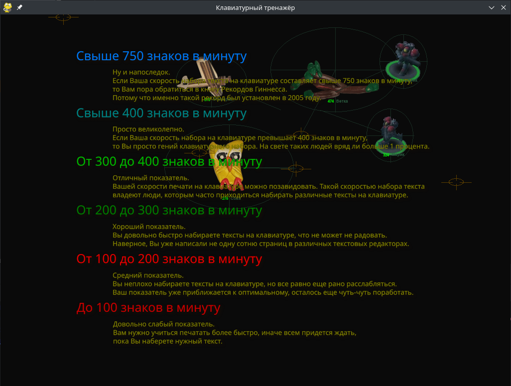
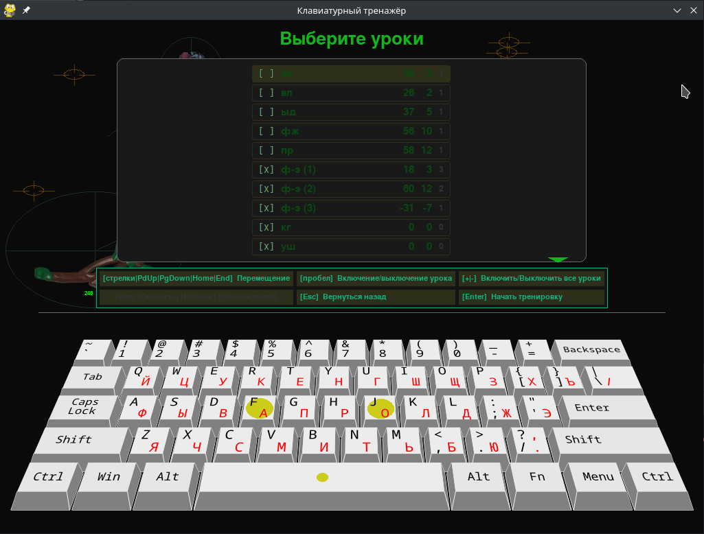
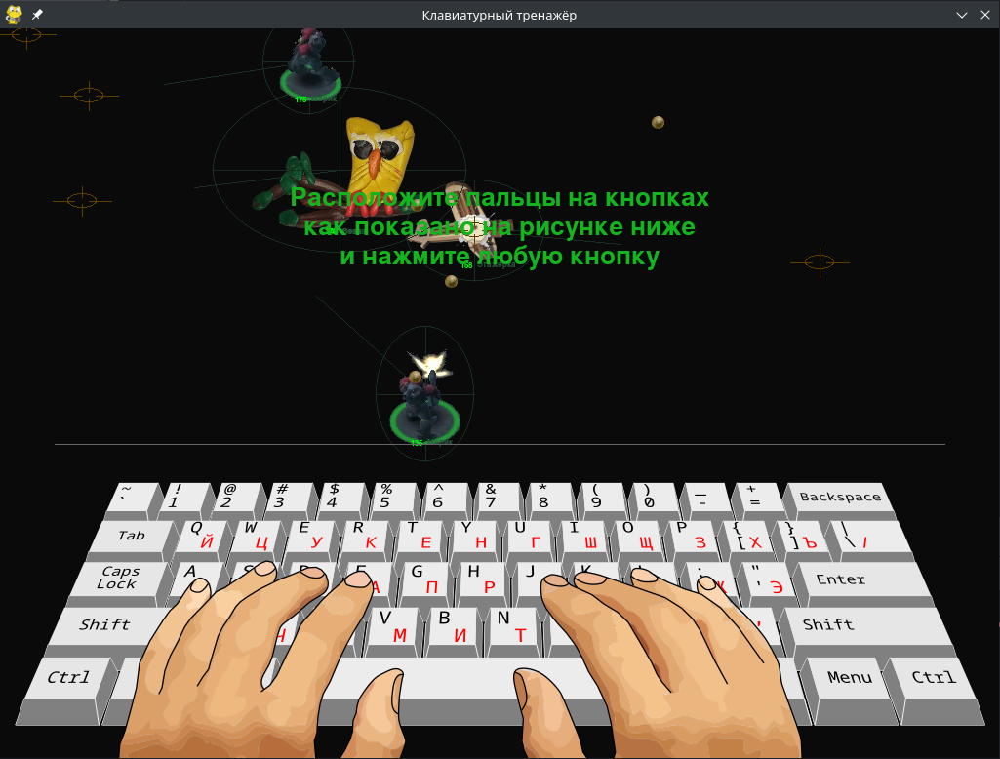
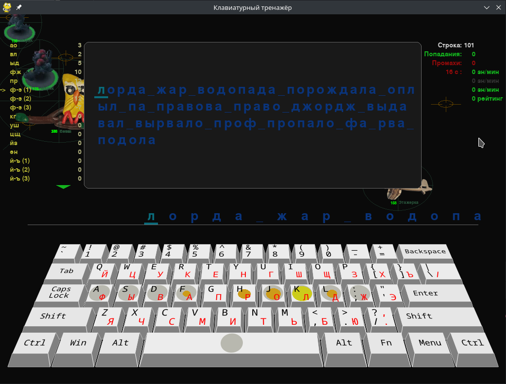

# Клавиатурный тренажёр | Keiboard Trainer

Написан на **python3** с использованием библиотеки **pygame**

Программа писалась как обучающий проект для детей и для их развлечения.

По сути это обычный Клавиатурный тренажёр с предварительно настроенными уроками и с продвинутым генератором текстов для сложных уроков.

А картинки просто для того, чтобы это не было так скучно. 

Все подсказки по управлению, как правило, есть на экране.

Файл конфигурации в json формате

## Начать играть

В папке [releases](releases/) находятся собранные бинарные файлы для linux и windows.

##
## Скриншоты
##

##

##

##

##